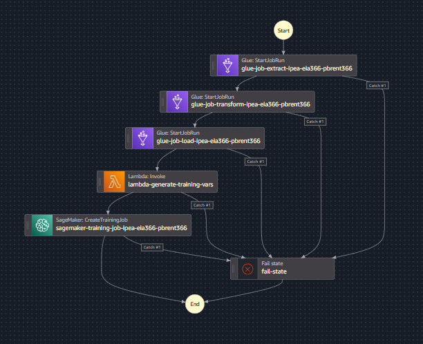

# ETL + ML com AWS e Terraform

Repositório referente a parte 3 do hands-on de ETL + ML com AWS da fase de Big Data da Pós Tech de Machine Learning Engineering da FIAP.

O objetivo desse exercício é provisionar com Terraform os recursos de um pipeline de dados e um job de treino e previsão com ML na AWS.  

## Descrição Geral

Este projeto implementa um pipeline de ETL + um job de treino de modelo de ML:

- Extrai dados do preço do petróleo bruto com o pacote [ipeadatapy](https://github.com/luanborelli/ipeadatapy), transforma os esses dados realizando engenharia de features para série temporal com [AWS Glue](https://aws.amazon.com/pt/glue/) utilizando [PySpark](https://spark.apache.org/docs/latest/api/python/index.html) e carrega os dados transformados em um bucket [S3](https://aws.amazon.com/pt/s3/);
- Um job de treino para ML do [Sagemaker](https://aws.amazon.com/pt/sagemaker/), com um modelo de ML customizado utilizando a biblioteca de ML [scikit-learn](https://scikit-learn.org/stable/), o qual recebe parâmetros para execução de uma função [Lambda](https://aws.amazon.com/pt/lambda/) da AWS;
- Utiliza [AWS Step Functions](https://aws.amazon.com/pt/step-functions/) para orquestrar os jobs ETL e job de treino de ML;
- E toda a infraestrutura é gerenciada usando [Terraform](https://www.terraform.io/) para garantir reprodutibilidade e controle de versão.

A seguir, uma imagem do pipeline da presente solução gerado pelo Step Functions:



## Pré-requisitos

- Terraform instalado na máquina local;
- Conta AWS (**não pode ser usuário root, se não o Terraform não funciona!**).

## Configuração

Certifique-se de que suas credenciais AWS estão configuradas corretamente:

```bash
aws configure
```

Ou configure o arquivo `~/.aws/credentials` com as chaves de acesso.

## Detalhes dos diretórios e arquivos do repositório 

* **`infra/ecr/`**: Contém o código do Terraform para criação de um repositório para guardar a imagem do modelo de ML.

* **`infra/glue/`**: Configura os jobs do AWS Glue, definindo os parâmetros necessários e referenciando os scripts no S3.

* **`infra/iam/`**: Contém a configuração Terraform para criar a role IAM necessária.

* **`infra/lambda/`**: Provisiona uma função Lambda para criação de parâmetros necessários para o job de treino do Sagemaker.

* **`infra/s3/`**: Provisiona o bucket S3 com os paths estruturados para armazenar os dados em diferentes estágios do pipeline.

* **`infra/stepfunctions/`**: Define a máquina de estados no AWS Step Functions para orquestrar os jobs de ETL e ML.

* **`src/etl/`**: Contém os scripts Python `glue-job-extract-ipea-eia366-pbrent366.py`, `glue-job-transform-ipea-eia366-pbrent366.py` e `glue-job-load-ipea-eia366-pbrent366.py` utilizados pelos jobs do Glue.

* **`src/lambda/`**: Contém o script Python `lambda_function.py` utilizado pela função Lambda.

* **`src/ml/`**: Contém o script Python `sagemaker-training-job-ipea-eia366-pbrent366` utilizado pelo Sagemaker Training Job.

* **`Dockerfile`**: Arquivo com instruções do Docker para contrução de uma imagem do job de ML, o qual é utilizada no Sagemaker.

## Provisionando recursos na AWS

Navegue até o diretório e aplique o Terraform:

```bash
cd <path do recurso no diretório infra/>
terraform init
terraform plan
terraform apply
```

> **Atenção para o recurso do ECR!** No caso da provisão do ECR, é necessário fazer o build e push da imagem. Para realizar o build da máquina local, é necessário ter o Docker Desktop por exemplo.

Para fazer o build vá até onde se encontra o Dockerfile, e execute:

```bash
docker build -t "<Id da conta da AWS>.dkr.ecr.<região>.amazonaws.com/ecr-ipea-eia366-pbrent366:latest" -f Dockerfile .
```

Depois é necessário fazer o login no ECR via AWS CLI:

```bash
aws ecr get-login-password --region <região> | docker login --username AWS --password-stdin <Id da conta da AWS>.dkr.ecr.<região>.amazonaws.com
```

E por fim, é necessário fazer o push da imagem para o repositório do ECR criado previamente:

```bash
docker push "<Id da conta da AWS>.dkr.ecr.<região>.amazonaws.com/ecr-ipea-eia366-pbrent366:latest"
```

> **Atenção para o recurso da função Lambda!** No caso da provisão da Lambda, é necessário ter no mesmo diretório de infra da Lambda (`infra/lambda/`), o arquivo zipado do script `lambda_function.py`.

## Destruição dos recursos na AWS

Para destruir os recursos provisionados:

```bash
cd <path do recurso no diretório infra/>
terraform destroy
```
