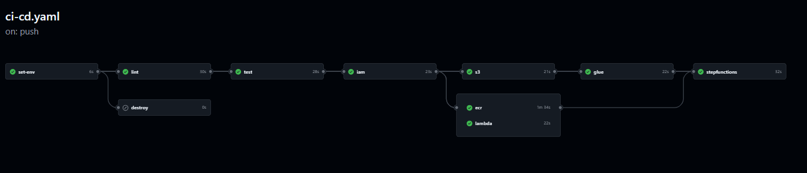

# ETL + ML com AWS e Terraform

Repositório referente a parte 3 do hands-on de ETL + ML com AWS da fase de Big Data da Pós Tech de Machine Learning Engineering da FIAP.

O objetivo desse exercício é provisionar com Terraform os recursos de um pipeline de dados e um job de treino e previsão com ML na AWS.  

## Descrição Geral

Este projeto implementa um pipeline de ETL + um job de treino de modelo de ML:

- Extrai dados do preço do petróleo bruto com o pacote [ipeadatapy](https://github.com/luanborelli/ipeadatapy), transforma os esses dados realizando engenharia de features para série temporal com [AWS Glue](https://aws.amazon.com/pt/glue/) utilizando [PySpark](https://spark.apache.org/docs/latest/api/python/index.html) e carrega os dados transformados em um bucket [S3](https://aws.amazon.com/pt/s3/);
- Um job de treino para ML do [Sagemaker](https://aws.amazon.com/pt/sagemaker/), com um modelo de ML customizado utilizando a biblioteca de ML [scikit-learn](https://scikit-learn.org/stable/), o qual recebe parâmetros para execução de uma função [Lambda](https://aws.amazon.com/pt/lambda/) da AWS;
- Utiliza [AWS Step Functions](https://aws.amazon.com/pt/step-functions/) para orquestrar os jobs ETL e job de treino de ML;
- E toda a infraestrutura é gerenciada usando [Terraform](https://www.terraform.io/) para garantir reprodutibilidade e controle de versão.

A seguir, uma imagem do pipeline da presente solução gerado pelo Step Functions:


## Pré-requisitos

- Terraform instalado na máquina local;
- Conta AWS (**não pode ser usuário root, se não o Terraform não funciona!**).

## Configuração

Certifique-se de que suas credenciais AWS estão configuradas corretamente:

```bash
aws configure
```

Ou configure o arquivo `~/.aws/credentials` com as chaves de acesso.

## Detalhes dos diretórios e arquivos do repositório 

* **`infra/ecr/`**: Contém o código do Terraform para criação de um repositório para guardar a imagem do modelo de ML.

* **`infra/glue/`**: Configura os jobs do AWS Glue, definindo os parâmetros necessários e referenciando os scripts no S3.

* **`infra/iam/`**: Contém a configuração Terraform para criar a role IAM necessária.

* **`infra/lambda/`**: Provisiona uma função Lambda para criação de parâmetros necessários para o job de treino do Sagemaker.

* **`infra/s3/`**: Provisiona o bucket S3 com os paths estruturados para armazenar os dados em diferentes estágios do pipeline.

* **`infra/stepfunctions/`**: Define a máquina de estados no AWS Step Functions para orquestrar os jobs de ETL e ML.

* **`src/etl/`**: Contém os scripts Python `glue-job-extract-ipea-eia366-pbrent366.py`, `glue-job-transform-ipea-eia366-pbrent366.py` e `glue-job-load-ipea-eia366-pbrent366.py` utilizados pelos jobs do Glue.

* **`src/lambda/`**: Contém o script Python `lambda_function.py` utilizado pela função Lambda.

* **`src/ml/`**: Contém o script Python `sagemaker-training-job-ipea-eia366-pbrent366` utilizado pelo Sagemaker Training Job.

* **`Dockerfile`**: Arquivo com instruções do Docker para contrução de uma imagem do job de ML, o qual é utilizada no Sagemaker.

## Provisionando recursos na AWS

Navegue até o diretório e aplique o Terraform:

```bash
cd <path do recurso no diretório infra/>
terraform init
terraform plan
terraform apply
```

> **Atenção para o recurso do ECR!** No caso da provisão do ECR, é necessário fazer o build e push da imagem. Para realizar o build da máquina local, é necessário ter o Docker Desktop por exemplo.

Para fazer o build vá até onde se encontra o Dockerfile, e execute:

```bash
docker build -t "<Id da conta da AWS>.dkr.ecr.<região>.amazonaws.com/ecr-ipea-eia366-pbrent366:latest" -f Dockerfile .
```

Depois é necessário fazer o login no ECR via AWS CLI:

```bash
aws ecr get-login-password --region <região> | docker login --username AWS --password-stdin <Id da conta da AWS>.dkr.ecr.<região>.amazonaws.com
```

E por fim, é necessário fazer o push da imagem para o repositório do ECR criado previamente:

```bash
docker push "<Id da conta da AWS>.dkr.ecr.<região>.amazonaws.com/ecr-ipea-eia366-pbrent366:latest"
```

> **Atenção para o recurso da função Lambda!** No caso da provisão da Lambda, é necessário ter no mesmo diretório de infra da Lambda (`infra/lambda/`), o arquivo zipado do script `lambda_function.py`.

## Destruição dos recursos na AWS

Para destruir os recursos provisionados:

```bash
cd <path do recurso no diretório infra/>
terraform destroy
```

# **BÔNUS!** Esteira de CI/CD com GitHub Actions + Terraform

No [MLOps](https://cloud.google.com/architecture/mlops-continuous-delivery-and-automation-pipelines-in-machine-learning), a esteira de CI/CD (Continuous Integration/Continuous Deployment) é um conjunto automatizado de processos que integra mudanças de código, valida modelos, e implanta pipelines de ML de forma confiável e eficiente. Ela abrange desde o controle de versão do código e execução de testes até o deployment contínuo de modelos de ML para ambientes de produção, garantindo consistência, qualidade e agilidade no ciclo de vida do modelo. 

[GitHub Actions](https://github.com/features/actions) é uma plataforma de automação integrada ao GitHub que permite configurar fluxos de trabalho personalizados para tarefas de CI/CD utilizando um arquivo YAML.

O .yaml está em `.github/workflows/`, o `ci-cd.yaml` define uma esteira CI/CD para gerenciar a infraestrutura de aplicações da AWS usando Terraform. Ele contém múltiplos *jobs*, incluindo etapas para destruir ou aplicar recursos AWS (como IAM, S3, Glue, ECR, Lambda e Step Functions), além de verificar e testar o código. Aqui estão os principais pontos desse arquivo:

1. **Gatilho de Execução**:  
   O fluxo é acionado por *push* na branch `main`. Ele decide entre aplicar ou destruir recursos com base no conteúdo do arquivo `terraform_action.txt`. Se o `terraform_action.txt` conter **apply** os recursos serão provisionados, se conter **destroy** os recursos serão destruídos. 

2. **Jobs**:  
   - **`set-env`**: Lê o comando (`apply` ou `destroy`) para direcionar os fluxos subsequentes.
   - **`destroy`**: Executa comandos Terraform para destruir recursos AWS caso o comando seja `destroy`.
   - **`lint` e `test`**: Validam e testam o código Python antes de provisionar recursos, se o comando for `apply`.
   - **Infraestrutura (IAM, S3, Glue, ECR, Lambda, Step Functions)**: Cada *job* configura e aplica (ou destrói) recursos específicos da AWS usando Terraform.
   - **Imagens Docker**: Constrói e envia imagens para o Amazon ECR, permitindo uso em tarefas ECS ou Step Functions.

3. **Terraform e AWS**:  
   Para cada serviço, as etapas incluem inicialização (`terraform init`), planejamento (`terraform plan`), e aplicação (`terraform apply`) ou destruição (`terraform destroy`). A configuração das credenciais AWS é feita automaticamente por ações do GitHub.

4. **Fluxo Condicional**:  
   A execução de cada *job* depende do resultado de `set-env` e da ação (`apply` ou `destroy`), garantindo flexibilidade e controle no pipeline.

> **Importante!** Antes de fazer o push para a branch `main`, é necessário fazer o push para a branch `terraform-backend` para criar o backend do Terraform para cada componente da solução possibilitando o uso do arquivo de estado do Terraform, sem isso fica impossível usar a esteira de CI/CD com Terraform.

Para executar a esteira de CI/CD é necessário fazer um push para branch `main`, o pipeline que verá no GitHub Actions será o seguinte:



# Pontos de melhoria no pipeline de ETL + ML?

- `No pipeline de ETL:`
    * É possível melhorar a qualidade do código modularizando o mesmo, assim como criar [docstring](https://www.datacamp.com/pt/tutorial/docstrings-python) para documentação;
    * Incluir job de [data quality](https://www.datacamp.com/cheat-sheet/data-quality-dimensions-cheat-sheet?utm_source=google&utm_medium=paid_search&utm_campaignid=21374847033&utm_adgroupid=165153435562&utm_device=c&utm_keyword=&utm_matchtype=&utm_network=g&utm_adpostion=&utm_creative=702515733971&utm_targetid=dsa-2264919291589&utm_loc_interest_ms=&utm_loc_physical_ms=9197252&utm_content=DSA~blog~Julia&utm_campaign=240617_1-sea~dsa~tofu_2-b2c_3-ptbr-lang-en_4-prc_5-na_6-na_7-le_8-pdsh-go_9-nb-e_10-na_11-na&gad_source=1&gclid=Cj0KCQiA3sq6BhD2ARIsAJ8MRwWrye8OAfRSWixKeLMxTJf5rHU3OpOzBQY7tKBq2_BE5Gy_QFXEQhcaAnmZEALw_wcB);
    * Realizar testes unitários para garantir a qualidade da solução.

- `Job de ML`: 
    * Testar mais tipos de modelos;
    * Explorar um espaço amostral maior de hiperparâmetros;
    * Usar algum serviço de versionamento de modelos como o [MLFlow](https://mlflow.org/) ou o próprio Sagemaker;
    * Criar um job de inferência em batch separado do job de treino.

- `Operações de ML`:
    * Para avançar no nível de maturidade de cultura MLOps, é necessários criar serviços para observabilidade e monitoramento de todos os serviços da solução;
    * Usar algum serviço para acompanhar a performance do modelo em produção como o [NannyML](https://www.nannyml.com/).

- `Esteira de CI/CD e arquivos do Terraform`:
    * É necessário parametrizar dados como `região` e `id` da conta AWS de modo que facilite reproduzir a solução;
    * Na esteira de CI/CD seria importante ter um job para checar cobertura de código, como o [Coverage.py](https://coverage.readthedocs.io/en/7.6.9/)

- `Versionamento de código`:
   * Para efeito didático, a solução está toda nesse único repositório, porém o ideal é ter cada componente da solução com seu próprio repositório.